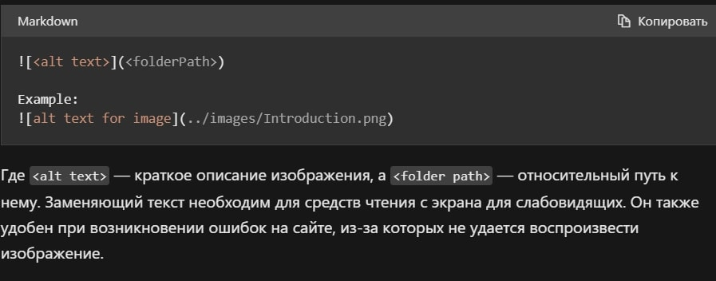

# Инструкция по работе с Markdown

## Выделение текста

Чтобы выделить текст курсивом, необходимо его обрамить звездочками (*) или знаком нижнего подчеркивания (_). Например: *вот так* или _вот так_.

Чтобы выделить текст полужирным, необходимо его обрамить двойными звездочками (**) или двойным знаком нижнего подчеркивания (__). Например: **вот так** или __вот так__.

Чтобы задать для текста полужирное и курсивное начертание, заключите его в тройные звездочки (***). Например: ***вот так***.

Чтобы сделать зачеркнутый текст, необходимо его обрамить двойными тильдами (~). Например: ~~вот так~~.

Альтернативные способы выделения текста жирным или курсивом нужны для того, чтобы мы могли совмещать оба этих способа. Например: _текст может выделен курсивом_ и при этом быть **полужирным**.

## Списки

Чтобы добавить ненумированные списки, необходимо пункты выделить звездочкой (*). Например:

* Первый список

* Второй список

* Третий список

Чтобы добавить нумерованные списки, необходимо пункты просто пронумеровать. Например:

1. Первый список
2. Второй список
3. Третий список

## Работа с изображениями

Чтобы вставить изображение в текст, достаточно написать следующее: 

## Ссылки

## Работа с таблицами

## Цитаты

Чтобы вставить в текст какую-нибудь цитату, необходимо перед текстом подставить стрелку больше (>). Например:

>Вот данная цитата.

## Заключение

## Итого

